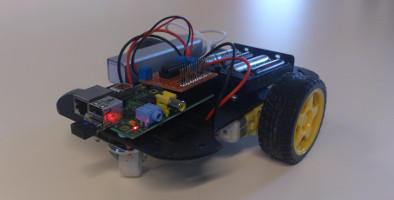
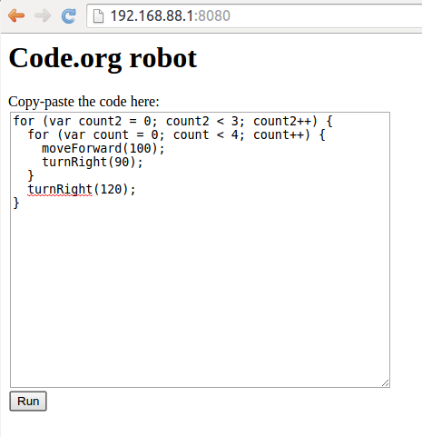
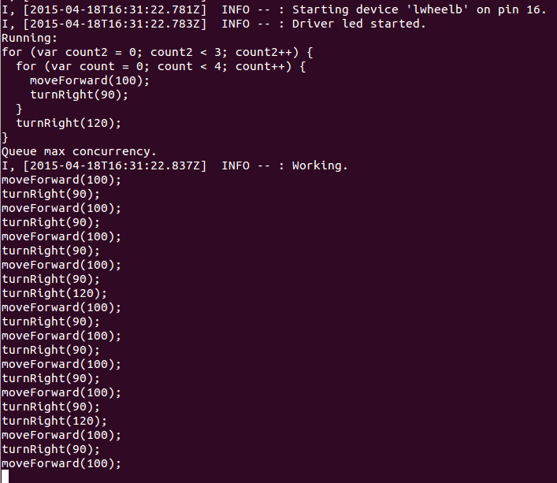

# A robot that executes the Code.org code #



## Hardware setup ##

 * Buy the [Ryantek RTK-000-003 Budget Robotics Kit](http://www.ryanteck.uk/store/ryanteck-budget-robotics-kit-for-raspberry-pi) with the wifi module and asseblme it
 * Also needed: as Raspberry Pi computer, a USB battery to run the Raspi wirelessly and 4 AAA sized batteries to power the wheels

For the setup stage you also need to connect the robot via HDMI to a monitor, via USB to a keyboard and via Ethernet cable to the Internet. Finally start the system by connecting power via USB.

## Software setup ##

Install the latest Rasbian as the operating system. Activate SSH and log in remotely so you can copy-paste the commands below from the comfort of you laptop or work station.

### Wifi access point setup ###

In stand alone robot mode there must be some way to wirelessly communicate to the robot. The most usable solution is to make the robot a wireless access point that its operator can connect to.

Follow instructions at http://seravo.fi/2014/create-wireless-access-point-hostapd to put the wifi module in master mode and provide a wifi access point. Make the SSID 'Robot' so it's easy to recognize the network. Use your laptop to connect to that wifi network and confirm it works by SSH'ing in to the Raspberry Pi computer.

### Node.js installation ###

First install 0.10 on newer version of Raspbian-compatible of Node.js (source http://weworkweplay.com/play/raspberry-pi-nodejs/)

```
wget http://node-arm.herokuapp.com/node_latest_armhf.deb
sudo dpkg -i node_latest_armhf.deb
```

### Server installation ###

Second step is to install this Node.js app and run it:

```
git clone https://github.com/ottok/code-org-robot.git
cd code-org-robot
npm install
sudo nodemon robot.js
```

Super user priviledges are needed so that the Cylon robotics library can access the GPIO pin controls.


## Running the robot ##

Once the robot is running, the operator can join the robot WLAN. Once connected, the operator should make sure the Node.js app is running and the web UI is visible. After that, simply copy-paste any code from Code.org and run it!






## TODO ##

 * Document better how wifi access point was set up and how Node.js app is automatically launched from /etc/rc.local
 * Better calibrate the robot's wheels to ensure clean 90 degree turns
 * Write more JavaScript functions to extend the compatibility with all possible function names used at Code.org
 * Imporive the web UI visuals, make is more colorful etc
 * Integrate a small IDE in the web UI to make writing more code plesant
 * Run eval() on the code already on the browser side and thus protect from failures in the eval() execution on the server side (as client side failure is easier for user to detect and debug than server)
 * Make server-client communication more real time, maybe provide a websocket based console that exposes in web ui what the server ran
 
